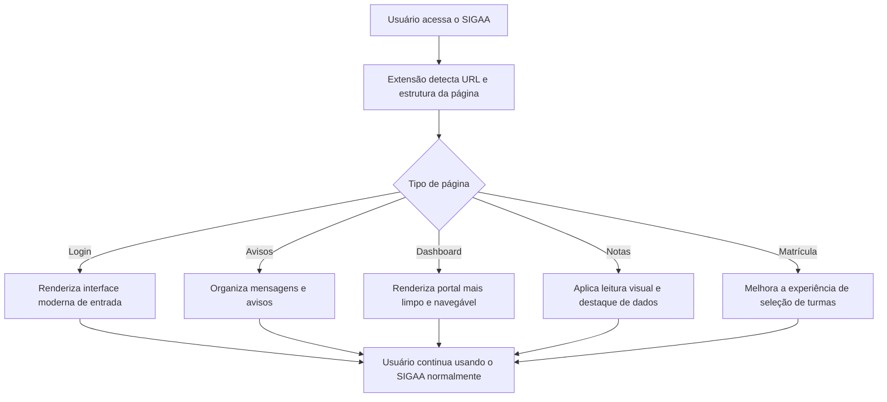

<div align="center">


<p>
  
</p>

<p>
  <a href="#-instalação">
    
  </a>
  <a href="https://github.com/RubsNeto/SigaaUI/issues">
    
  </a>
  <a href="https://github.com/RubsNeto/SigaaUI/pulls">
    
  </a>
</p>

<p>
  
  
  
  
</p>

<p>
  <strong>SigaaUI</strong> é uma <strong>extensão de navegador</strong> open-source que moderniza a interface do <strong>SIGAA UFJ</strong>, trazendo uma experiência mais limpa, organizada e agradável, sem alterar o backend original do sistema.
</p>

<sub>Projeto comunitário criado por alunos, sem afiliação oficial com a UFJ, STI ou equipe do SIGAA.</sub>

<br/><br/>

<a href="#-visão-geral">Visão geral</a> •
<a href="#-instalação">Instalação</a> •
<a href="#-funcionalidades">Funcionalidades</a> •
<a href="#-arquitetura">Arquitetura</a> •
<a href="#-estrutura-do-repositório">Estrutura</a> •
<a href="#-roadmap">Roadmap</a> •
<a href="#-contribuindo">Contribuindo</a> •
<a href="#-privacidade">Privacidade</a>

</div>

---

## 🔎 Visão geral

O **SigaaUI** aplica um redesign moderno ao SIGAA UFJ por meio de uma extensão de navegador que atua diretamente sobre a interface já carregada pelo sistema.

A proposta é melhorar a experiência visual e de navegação em páginas acadêmicas que ainda possuem estrutura antiga, excesso de tabelas e baixa legibilidade, sem interferir no funcionamento do backend original.

### Páginas suportadas
- ✅ Tela de login
- ✅ Avisos do sistema
- ✅ Portal do discente
- ✅ Relatório de notas
- ✅ Matrícula on-line
- ✅ Turmas do currículo
- ✅ Turmas selecionadas

---

## ⚡ Instalação

### Instalação manual (modo desenvolvedor)

1. Faça o download deste repositório em **Code > Download ZIP** ou clone com:

   ```bash
   git clone https://github.com/RubsNeto/SigaaUI.git
   ```

2. Abra o Google Chrome, Microsoft Edge ou outro navegador compatível com extensões Chromium.

3. Acesse:
   - **Chrome:** `chrome://extensions/`
   - **Edge:** `edge://extensions/`

4. Ative o **Modo do desenvolvedor**.

5. Clique em **Carregar sem compactação**.

6. Selecione a pasta:

   ```text
   extension/
   ```

7. Acesse o [SIGAA UFJ](https://sigaa.sistemas.ufj.edu.br/sigaa/) normalmente.

> A extensão roda localmente no navegador e não depende de backend, API intermediária ou servidor próprio.

---

## ✨ Funcionalidades

### UI moderna
Substitui partes visuais antigas por uma interface mais limpa, clara e melhor organizada.

### Melhor legibilidade
Tipografia, espaçamento e hierarquia visual ajustados para facilitar leitura e navegação.

### Navegação mais intuitiva
Melhora a usabilidade em fluxos comuns dentro do SIGAA, reduzindo atrito em páginas importantes.

### Relatório de notas mais visual
Destaca informações acadêmicas de forma mais fácil de interpretar.

### Matrícula mais organizada
Torna a experiência de seleção de turmas mais compreensível e visualmente estruturada.

### 100% client-side
Tudo roda localmente no navegador do usuário:
- sem backend
- sem servidor intermediário
- sem coleta de dados
- sem tracking

---

## 🧠 Arquitetura

A extensão atua com **content scripts**, analisando a URL e a estrutura do DOM para identificar a página atual e aplicar a interface correspondente.

A lógica do SIGAA continua funcionando normalmente em segundo plano. O **SigaaUI** atua somente na camada visual e de interação.



---

## 🎨 Direção visual

A interface foi pensada para atualizar a aparência do SIGAA sem perder compatibilidade com o fluxo real do sistema.

### Paleta base
- **Primary:** `#0891b2`
- **Dark:** `#141c2e`
- **Accent:** `#17428c`
- **Success:** `#16a34a`
- **Danger:** `#dc2626`
- **Background:** `#f4f6f9`

### Objetivos visuais
- reduzir poluição visual
- melhorar a hierarquia da informação
- facilitar leitura prolongada
- deixar a experiência mais agradável para o estudante

---

## 🗂️ Estrutura do repositório

```text
SigaaUI/
├─ extension/
│  ├─ icons/
│  │  ├─ icon16.png
│  │  ├─ icon48.png
│  │  └─ icon128.png
│  ├─ content.js
│  └─ manifest.json
├─ LICENSE
├─ README.md
├─ index.js
├─ matricula-test.html
├─ Pórtico-de-entrada...
└─ turmas-curriculo-...
```

### O que cada parte faz

#### `extension/`
Contém a implementação principal da extensão.

- **manifest.json**: configuração da extensão
- **content.js**: lógica principal de detecção, leitura do DOM e injeção da interface
- **icons/**: ícones utilizados pela extensão

#### Arquivos auxiliares na raiz
Os demais arquivos podem ser usados como apoio para testes locais, prototipação, validação de telas específicas ou experimentos durante o desenvolvimento.

---

## 🧨 Limitações conhecidas

- O SIGAA utiliza uma estrutura legada, baseada em HTML antigo e componentes pouco previsíveis.
- Caso a instituição altere IDs, classes, tabelas ou fluxo das páginas, partes do redesign podem quebrar.
- Algumas páginas internas mais específicas ainda podem continuar com a interface original.
- Como o sistema possui comportamentos dinâmicos em certas áreas, ajustes contínuos podem ser necessários.

---

## 🗺️ Roadmap

- [x] Estruturação como extensão de navegador
- [x] Redesign do fluxo de matrícula
- [x] Melhoria visual do relatório de notas
- [ ] Popup da extensão com preferências
- [ ] Modo escuro nativo
- [ ] Melhor cobertura de páginas internas
- [ ] Compatibilidade com Firefox
- [ ] Publicação em loja oficial de extensões

---

## 🤝 Contribuindo

Contribuições são muito bem-vindas.

Se você quiser sugerir melhorias, relatar bugs ou enviar código, este repositório está aberto para colaboração da comunidade.

### Para sugerir uma melhoria ou reportar bug
Abra uma **Issue** informando:
- o problema ou a sugestão
- a página do SIGAA em que isso acontece
- prints, se possível
- passos para reproduzir
- navegador utilizado

### Para enviar código
1. Faça um fork do projeto
2. Crie uma branch:

   ```bash
   git checkout -b feat/minha-melhoria
   ```

   ou:

   ```bash
   git checkout -b fix/correcao-importante
   ```

3. Faça commits claros e objetivos
4. Abra um Pull Request

### Boas práticas para PR
- mantenha mudanças focadas
- explique claramente o que foi alterado
- evite misturar refatoração com correção de bug sem necessidade
- teste no SIGAA real sempre que possível

---

## 🔐 Privacidade

O **SigaaUI não coleta, rastreia, armazena ou envia dados pessoais** para servidores de terceiros.

- sem backend
- sem analytics
- sem tracking
- sem armazenamento de senha
- sem coleta de navegação

Todo o processamento acontece localmente, no navegador do usuário.

---

## 📄 Licença

Este projeto está sob a licença **MIT**.

Você pode usar, estudar, modificar e distribuir o código, desde que mantenha os créditos e os termos da licença.

Veja o arquivo [`LICENSE`](LICENSE) para mais detalhes.

---

## 💙 Observação final

Se este projeto te ajudou, considere:
- deixar uma estrela no repositório
- abrir uma issue com sugestões
- contribuir com melhorias no código
- compartilhar com outros alunos da UFJ

Projeto feito de aluno para aluno.
